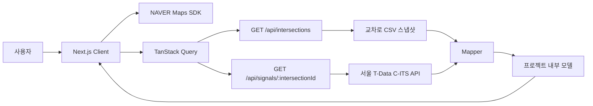

<div align="center">

# GreenGreen

### 서울의 보행자 신호를 지도 위에서 더 쉽고 안전하게

현재 지도에 보이는 교차로를 탐색하고, 선택한 교차로의 보행신호와 남은 시간을 확인할 수 있는 실시간 지도 서비스입니다.

[](https://nextjs.org/)
[](https://www.typescriptlang.org/)
[](https://react.dev/)
[](https://tanstack.com/query)
[](https://pnpm.io/)

</div>

---

## 프로젝트 소개

GreenGreen은 서울의 보행자 신호정보를 지도에서 직관적으로 확인하기 위해 시작한 프로젝트입니다.

보행신호 데이터는 빠르게 변하고, 모든 교차로의 데이터를 한꺼번에 요청하면 불필요한 네트워크 비용이 발생합니다. GreenGreen은 **현재 화면에 필요한 교차로만 찾고, 사용자가 선택한 한 곳의 신호만 조회**합니다. 서버에서 받은 잔여시간은 브라우저에서 카운트다운하고 일정 주기로 다시 동기화해 API 호출과 실시간성 사이의 균형을 맞췄습니다.

> [!IMPORTANT]
> 제공되는 신호정보는 통신 상태에 따라 실제 신호와 차이가 발생할 수 있습니다. 횡단 시 반드시 실제 신호등을 확인하세요.

## 주요 기능

- **지도 기반 교차로 탐색** — 현재 지도 범위 안에 있는 신호 교차로를 마커로 표시합니다.
- **실시간 보행신호 확인** — 선택한 교차로의 방향별 신호 상태와 잔여시간을 제공합니다.
- **클라이언트 카운트다운** — 매초 서버를 호출하지 않고 최신 응답을 기준으로 남은 시간을 계산합니다.
- **현재 위치 이동** — 브라우저 Geolocation API로 현재 위치를 찾아 지도를 이동합니다.
- **신호 방향 시각화** — 선택한 마커 주변에 방향별 횡단보도 신호 상태를 색상으로 표현합니다.
- **오래된 데이터 차단** — 일정 시간 이상 갱신되지 않은 데이터는 현재 신호처럼 표시하지 않습니다.
- **반응형 인터페이스** — 데스크톱과 모바일 환경에서 지도를 중심으로 사용할 수 있도록 구성했습니다.

## 사용 중인 외부 서비스

| 서비스 | 용도 | 연동 위치 |
| --- | --- | --- |
| [NAVER Maps JavaScript API v3](https://navermaps.github.io/maps.js.ncp/) | 지도 렌더링, 이동·확대/축소, 사용자 정의 마커와 지도 이벤트 | 브라우저 |
| [서울교통빅데이터플랫폼 T-Data](https://t-data.seoul.go.kr/) | C-ITS 교차로 정보와 실시간 신호·잔여시간 제공 | Next.js 서버 |
| Browser Geolocation API | 사용자의 현재 위치 확인 | 브라우저 |

NAVER Maps의 Web Client ID는 지도를 로드하기 위해 브라우저에서 사용합니다. 반면 T-Data API Key는 외부에 노출되지 않도록 Next.js Route Handler에서만 읽습니다.

## 아키텍처



브라우저가 T-Data를 직접 호출하지 않는 것이 핵심입니다. 외부 API의 인증, 타임아웃, 오류 처리는 서버에 두고, 외부 응답은 mapper를 거쳐 애플리케이션 내부 타입으로 변환합니다. UI는 T-Data의 필드명이나 응답 구조를 알 필요가 없습니다.

### 교차로 조회 흐름

1. 지도 이동이 끝나는 `idle` 이벤트를 기다립니다.
2. 400ms debounce 후 현재 화면의 경계와 줌을 읽습니다.
3. 줌 16 이상일 때만 교차로 조회를 활성화합니다.
4. 경계 좌표를 정규화해 미세한 지도 이동이 매번 새로운 Query Key를 만들지 않게 합니다.
5. 서버는 공식 CSV 스냅샷에서 현재 경계 안의 교차로만 골라 반환합니다.

```text
Map idle → debounce → bounds 정규화 → /api/intersections → marker 갱신
```

### 실시간 신호 조회 흐름

1. 사용자가 교차로 마커를 선택했을 때만 신호 Query를 활성화합니다.
2. Route Handler가 T-Data API에서 해당 교차로의 최신 신호를 조회합니다.
3. mapper가 외부 필드를 방향별 신호 상태와 초 단위 잔여시간으로 변환합니다.
4. 브라우저는 응답 수신 시각을 기준으로 1초마다 화면의 카운트다운만 갱신합니다.
5. 10초 주기로 서버와 동기화하며, 유효한 잔여시간이 0초가 되면 한 번 더 즉시 조회합니다.

```text
Marker 선택 → /api/signals/:id → T-Data → 내부 모델 → client countdown
```

### 안전한 데이터 표시

- 장비 관측 시각과 서버 수신 시각을 분리해 관리합니다.
- 관측 후 30초가 지난 신호는 `stale`로 판단합니다.
- stale 데이터의 방향별 상태는 `정보 없음`으로 바꾸고 잔여시간을 숨깁니다.
- V2X 규격의 invalid 잔여값(`36001`)은 실제 시간으로 표시하지 않습니다.
- 실시간 신호 응답은 `no-store`로 반환해 중간 캐시로 인한 오표시를 방지합니다.

## 구현 포인트

### 지도 SDK 격리

NAVER Maps SDK 관련 타입과 동작은 `src/adapters/map/naverMap.adapter.ts`에 모았습니다. 컴포넌트와 비즈니스 로직에서는 `naver.maps.LatLng` 대신 `MapCoordinate`, `MapBounds` 같은 프로젝트 타입을 사용합니다. 지도 공급자를 변경하더라도 상위 로직의 수정 범위를 줄일 수 있는 구조입니다.

### 서버를 보호하는 조회 전략

교차로는 줌과 화면 범위를 기준으로 조회하고, 신호는 선택한 교차로 한 곳에 대해서만 요청합니다. TanStack Query의 캐시와 `keepPreviousData`를 활용해 지도를 움직일 때 기존 마커가 불필요하게 깜빡이지 않도록 했습니다.

### 외부 데이터와 UI의 분리

T-Data 응답은 service와 mapper를 거쳐 `Intersection`, `PedestrianSignal` 모델로 변환됩니다. 외부 필드가 변경되더라도 mapper를 중심으로 대응하고, 화면 컴포넌트는 안정적인 내부 모델만 사용합니다.

### 컴포넌트와 로직의 분리

각 UI 컴포넌트는 렌더링을 담당하는 `.tsx`, 스타일을 담당하는 CSS Module, 상태와 이벤트를 담당하는 `useComponentName.ts`로 구성했습니다. 지도 이벤트, React Query, 타이머, 데이터 가공 로직을 훅으로 분리해 화면 코드를 읽기 쉽게 유지합니다.

## 기술 스택

| 영역 | 기술 |
| --- | --- |
| Framework | Next.js 16 App Router |
| Language | TypeScript 5 |
| UI | React 19, CSS Modules |
| Server State | TanStack Query 5 |
| Map | NAVER Maps JavaScript API v3 |
| Traffic Data | 서울 T-Data C-ITS API |
| Package Manager | pnpm 12 |

## 프로젝트 구조

```text
src/
├─ adapters/map/              # NAVER Maps SDK 어댑터
├─ app/
│  ├─ api/intersections/      # 지도 범위 기반 교차로 Route Handler
│  ├─ api/signals/[intersectionId]/ # 교차로별 실시간 신호 Route Handler
│  └─ page.tsx
├─ components/
│  ├─ SignalCard/             # 신호 상세와 카운트다운
│  └─ TrafficMap/             # 지도, 조회 상태, 현재 위치
├─ constants/                 # 줌, debounce, polling, stale 기준
├─ data/                      # T-Data 교차로 CSV 스냅샷
├─ services/
│  └─ tData/                  # T-Data client, service, mapper
└─ types/                     # 외부 SDK와 분리된 내부 모델
```

## 시작하기

### 1. 저장소 설치

```bash
git clone <repository-url>
cd GreenGreen
pnpm install
```

### 2. 환경변수 설정

프로젝트 루트에 `.env.local`을 만들고 다음 값을 설정합니다.

```dotenv
# NAVER Cloud Platform Web Dynamic Map Client ID
NEXT_PUBLIC_NAVER_MAP_CLIENT_ID=your_naver_maps_client_id

# 서울 T-Data Open API 인증키 — 서버에서만 사용
TDATA_API_KEY=your_tdata_api_key

# 선택 사항: latest(기본값) 또는 legacy
TDATA_INTERSECTION_SOURCE=latest
```

> `.env.local`은 Git에 커밋하지 않습니다. NAVER Maps 애플리케이션에는 개발 및 배포 환경의 Web 서비스 URL을 등록해야 합니다.

교차로 위치는 기본적으로 최신 스냅샷을 사용합니다. 이전 998개 스냅샷으로
되돌려야 하면 `TDATA_INTERSECTION_SOURCE=legacy`로 변경한 뒤 서버를 다시
시작합니다.

### 3. 개발 서버 실행

```bash
pnpm dev
```

브라우저에서 [http://localhost:3000](http://localhost:3000)을 열어 확인합니다.

## API

| Method | Endpoint | 설명 | Cache |
| --- | --- | --- | --- |
| `GET` | `/api/intersections?north=&east=&south=&west=` | 지도 경계 안의 교차로 조회 | 60초, SWR 300초 |
| `GET` | `/api/signals/:intersectionId` | 선택한 교차로의 최신 보행신호 조회 | `no-store` |

## Codex 활용

이 프로젝트에서는 [OpenAI Codex](https://developers.openai.com/codex/)를 단순 코드 생성기가 아니라 **구현 과정을 함께 검토하는 페어 프로그래밍 도구**로 활용했습니다.

- 요구사항을 지도, 위치, 범위 조회, 마커, 신호, 카운트다운처럼 작은 단계로 나누었습니다.
- 기존 코드와 프로젝트 규칙을 먼저 읽게 한 뒤, 컴포넌트·훅·서비스·mapper의 책임을 나누는 데 활용했습니다.
- 지도 이벤트와 실시간 데이터처럼 순서가 중요한 로직에는 처리 이유가 드러나는 주석을 작성하도록 했습니다.
- 외부 API 응답을 그대로 신뢰하지 않도록 타입 검증, 오류 처리, stale 판정 같은 예외 상황을 함께 점검했습니다.
- 변경 후에는 lint, TypeScript 검사, production build 결과를 확인하는 검증 루프에 활용했습니다.

Codex가 제안하고 작성한 결과를 그대로 채택하기보다, 서비스의 안전 기준과 데이터 흐름은 사람이 결정하고 실제 코드와 실행 결과를 기준으로 검토했습니다.

## 검증

```bash
pnpm lint
pnpm type-check
pnpm build
```

---

<div align="center">

**GreenGreen은 보행 판단을 대신하지 않습니다. 길을 건널 때는 언제나 현장의 실제 신호등을 확인해 주세요.**

</div>
