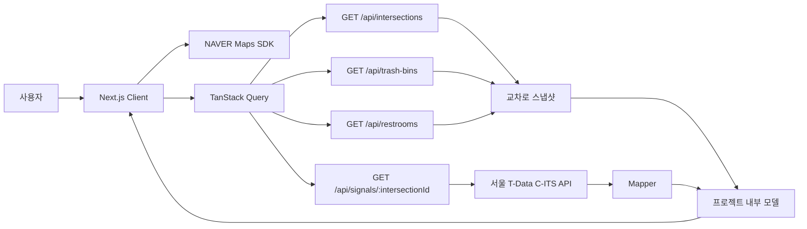

<div align="center">

# GreenGreen

### 보행자 신호와 생활 편의시설을 한 지도에서

실시간 보행신호와 잔여시간을 확인하고, 주변 휴지통과 공중화장실을 탐색할 수 있는 생활 지도 서비스입니다.

[](https://nextjs.org/)
[](https://www.typescriptlang.org/)
[](https://react.dev/)
[](https://tanstack.com/query)
[](https://pnpm.io/)

</div>

---

## 프로젝트 소개

GreenGreen은 서울의 보행자 신호정보를 지도에서 직관적으로 확인하기 위해 시작해, 주변 생활 편의시설까지 함께 탐색할 수 있도록 확장한 프로젝트입니다.

보행신호 데이터는 빠르게 변하고, 수천 개의 위치 데이터를 한꺼번에 그리면 불필요한 네트워크·렌더링 비용이 발생합니다. GreenGreen은 **현재 화면에 필요한 위치만 조회하고, 사용자가 선택한 한 교차로의 신호만 요청**합니다. 서버에서 받은 잔여시간은 브라우저에서 카운트다운하며, 휴지통과 화장실은 정규화된 정적 스냅샷에서 화면 범위에 포함된 데이터만 반환합니다.

> [!IMPORTANT]
> 제공되는 신호정보는 통신 상태에 따라 실제 신호와 차이가 발생할 수 있습니다. 횡단 시 반드시 실제 신호등을 확인하세요.

## 주요 기능

- **지도 기반 교차로 탐색** — 현재 지도 범위 안에 있는 신호 교차로를 마커로 표시합니다.
- **실시간 보행신호 확인** — 선택한 교차로의 방향별 신호 상태와 잔여시간을 제공합니다.
- **클라이언트 카운트다운** — 매초 서버를 호출하지 않고 최신 응답을 기준으로 남은 시간을 계산합니다.
- **3단계 현재 위치 모드** — 한 번 누르면 현재 위치로 이동하고, 다시 누르면 실시간 위치와 기기가 바라보는 방향을 따라갑니다. 방향 센서를 사용할 수 없으면 이동 방향으로 대체하며, 지도 조작 시에는 자동으로 해제됩니다.
- **신호 방향 시각화** — 선택한 마커 주변에 방향별 횡단보도 신호 상태를 색상으로 표현합니다.
- **오래된 데이터 차단** — 일정 시간 이상 갱신되지 않은 데이터는 현재 신호처럼 표시하지 않습니다.
- **생활 편의시설 레이어** — 신호등·휴지통·화장실 중 하나를 선택해 필요한 정보에 집중할 수 있습니다.
- **공중화장실 상세 정보** — 화장실 마커에서 주소, 개방시간, 시설 현황과 연락처를 확인할 수 있습니다.
- **범위 기반 마커 갱신** — 지도 밖으로 나간 마커만 제거하고 공통 마커는 재사용해 이동 중 깜빡임을 줄였습니다.
- **반응형 인터페이스** — 데스크톱과 모바일 환경에서 지도를 중심으로 사용할 수 있도록 구성했습니다.

## 외부 서비스 및 데이터

| 서비스·데이터 | 용도 | 연동 위치 |
| --- | --- | --- |
| [NAVER Maps JavaScript API v3](https://navermaps.github.io/maps.js.ncp/) | 지도 렌더링, 이동·확대/축소, 사용자 정의 마커와 지도 이벤트 | 브라우저 |
| [서울교통빅데이터플랫폼 T-Data](https://t-data.seoul.go.kr/) | C-ITS 교차로 정보와 실시간 신호·잔여시간 제공 | Next.js 서버 |
| 전국휴지통표준데이터 | 휴지통 위치, 유형, 관리기관 정보 | 정적 JSON 스냅샷 |
| 서울시 공중화장실 위치정보·원주시 화장실 위치 JSON | 화장실 좌표, 주소, 개방시간, 시설 정보 | 정적 JSON 스냅샷 |
| Browser Geolocation API | 사용자의 현재 위치 확인 | 브라우저 |

NAVER Maps의 Web Client ID는 지도를 로드하기 위해 브라우저에서 사용합니다. 반면 T-Data API Key는 외부에 노출되지 않도록 Next.js Route Handler에서만 읽습니다. 휴지통과 화장실은 런타임에 주소를 좌표로 변환하지 않고, 미리 정규화해 저장한 좌표를 사용하므로 지도 이동마다 지오코딩 API를 호출하지 않습니다.

> [!NOTE]
> 공공데이터의 위치와 운영 정보는 갱신 시점 또는 현장 사정에 따라 실제와 다를 수 있습니다.

### 현재 데이터 스냅샷

| 레이어 | 기본 데이터 | 레코드 수 | 제공 범위 |
| --- | --- | ---: | --- |
| 신호등 | V2X 교차로 MAP 정보 최신본 | 2,779 | 서울 |
| 휴지통 | 전국휴지통표준데이터 정규화본 | 3,753 | 원본에 좌표가 제공된 지역 |
| 화장실 | 서울시·원주시 화장실 위치정보 | 4,475 | 서울·원주 |

교차로는 `TDATA_INTERSECTION_SOURCE=legacy` 설정으로 이전 998개 스냅샷을 선택할 수 있습니다. 위 숫자는 현재 저장소에 포함된 파일 기준이며, 원본 데이터를 다시 변환하면 달라질 수 있습니다.

## 아키텍처


```mermaid
flowchart LR
    U[사용자] --> UI[Next.js Client]
    UI --> MAP[NAVER Maps SDK]
    UI --> QUERY[TanStack Query]

    QUERY --> IR["GET /api/intersections"]
    QUERY --> SR["GET /api/signals/:intersectionId"]
    QUERY --> TR["GET /api/trash-bins"]
    QUERY --> RR["GET /api/restrooms"]

    IR --> SNAPSHOT[교차로 스냅샷]
    TR --> SNAPSHOT
    RR --> SNAPSHOT
    SR --> TDATA[서울 T-Data C-ITS API]

    SNAPSHOT --> MODEL
    TDATA --> MAPPER[Mapper]
    MAPPER --> MODEL[프로젝트 내부 모델]
    MODEL --> UI
```

브라우저가 T-Data를 직접 호출하지 않는 것이 핵심입니다. 외부 API의 인증, 타임아웃, 오류 처리는 서버에 두고, 외부 응답은 mapper를 거쳐 애플리케이션 내부 타입으로 변환합니다. 정적 위치 데이터도 같은 내부 모델과 Route Handler 경계를 사용하므로 UI는 원본 데이터의 필드명이나 파일 구조를 알 필요가 없습니다.

### 교차로 조회 흐름

1. 지도 이동이 끝나는 `idle` 이벤트를 기다립니다.
2. 400ms debounce 후 현재 화면의 경계와 줌을 읽습니다.
3. 줌 16 이상일 때만 교차로 조회를 활성화합니다.
4. 경계 좌표를 정규화해 미세한 지도 이동이 매번 새로운 Query Key를 만들지 않게 합니다.
5. 서버는 공식 CSV 스냅샷에서 현재 경계 안의 교차로만 골라 반환합니다.

```text
Map idle → debounce → bounds 정규화 → /api/intersections → marker 갱신
```

### 생활 편의시설 조회 흐름

1. 사용자가 상단 탭에서 휴지통 또는 화장실 레이어를 선택합니다.
2. 줌 16 이상에서 현재 지도 경계에 포함된 위치만 Route Handler로 조회합니다.
3. 서버는 정적 JSON 스냅샷을 필터링해 화면에 필요한 데이터만 반환합니다.
4. 지도 어댑터는 기존 마커와 새 결과를 ID로 비교합니다.
5. 화면 밖 마커만 제거하고 새로 들어온 마커만 추가합니다.
6. 화장실 마커를 선택하면 주소, 개방시간, 시설 현황 등의 상세 팝업을 표시합니다.

```text
Layer 선택 → idle/debounce → bounds 조회 → snapshot 필터링 → marker diff
```

### 실시간 신호 조회 흐름

1. 사용자가 교차로 마커를 선택했을 때만 신호 Query를 활성화합니다.
2. Route Handler가 T-Data API에서 해당 교차로의 최신 신호를 조회합니다.
3. mapper가 외부 필드를 방향별 신호 상태와 초 단위 잔여시간으로 변환합니다.
4. 서버 응답의 잔여시간에는 현장에서 확인한 지연을 고려해 3초 안전 보정값을 적용합니다.
5. 브라우저는 응답 수신 시각을 기준으로 1초마다 화면의 카운트다운만 갱신합니다.
6. 0초 도달 후 1초를 기다려 다시 조회하고, 새 응답의 보정 잔여시간도 1초 미만이면 2초 후 재시도합니다.
7. 사용자가 누르는 새로고침은 5초에 한 번만 허용하며, 데이터가 stale 되기 전에도 최신 신호와 동기화를 시도합니다.

```text
Marker 선택 → /api/signals/:id → T-Data → 내부 모델 → client countdown
```

### 안전한 데이터 표시

- 장비 관측 시각과 서버 수신 시각을 분리해 관리합니다.
- 관측 후 30초가 지난 신호는 `stale`로 판단합니다.
- stale 데이터의 방향별 상태는 `정보 없음`으로 바꾸고 잔여시간을 숨깁니다.
- V2X 규격의 invalid 잔여값(`36001`)은 실제 시간으로 표시하지 않습니다.
- 통신 지연에 대비해 서버의 잔여시간에서 3초를 보수적으로 차감합니다.
- 실시간 신호 응답은 `no-store`로 반환해 중간 캐시로 인한 오표시를 방지합니다.

## 구현 포인트

### 지도 SDK 격리

NAVER Maps SDK 관련 타입과 동작은 `src/adapters/map/naverMap.adapter.ts`에 모았습니다. 컴포넌트와 비즈니스 로직에서는 `naver.maps.LatLng` 대신 `MapCoordinate`, `MapBounds` 같은 프로젝트 타입을 사용합니다. 지도 공급자를 변경하더라도 상위 로직의 수정 범위를 줄일 수 있는 구조입니다.

### 서버를 보호하는 조회 전략

교차로·휴지통·화장실은 줌과 화면 범위를 기준으로 조회하고, 신호는 선택한 교차로 한 곳에 대해서만 요청합니다. TanStack Query의 캐시와 `keepPreviousData`를 활용하고, 생활 편의시설 마커는 ID 기준으로 증분 갱신해 지도 이동 때 불필요한 깜빡임을 줄였습니다.

### 외부 데이터와 UI의 분리

T-Data 응답은 service와 mapper를 거쳐 `Intersection`, `PedestrianSignal` 모델로 변환됩니다. 휴지통과 화장실 원본 데이터 역시 사전 변환 과정에서 각각 `TrashBin`, `Restroom` 모델에 맞춰 정규화합니다. 외부 필드가 변경되더라도 변환 경계에서 대응하고, 화면 컴포넌트는 안정적인 내부 모델만 사용합니다.

### 스냅샷 기반 위치 데이터

교차로와 생활 편의시설 위치는 저장소의 정적 JSON 스냅샷으로 관리합니다. Route Handler가 지도 경계를 기준으로 필터링하기 때문에 전체 파일이 브라우저로 전송되지 않으며, 서비스 이용 중 별도의 주소→좌표 변환 호출도 발생하지 않습니다. 서울 화장실 원본은 `pnpm data:restrooms <원본-json-경로>`로 재생성하고, 추가 데이터는 `pnpm data:restrooms:merge <원본-json-경로>` 또는 `pnpm data:trash-bins:merge <원본-csv-경로>`로 중복 없이 병합할 수 있습니다.

### 컴포넌트와 로직의 분리

각 UI 컴포넌트는 렌더링을 담당하는 `.tsx`, 스타일을 담당하는 CSS Module, 상태와 이벤트를 담당하는 `useComponentName.ts`로 구성했습니다. 지도 이벤트, React Query, 타이머, 데이터 가공 로직을 훅으로 분리해 화면 코드를 읽기 쉽게 유지합니다.

## 기술 스택

| 영역 | 기술 |
| --- | --- |
| Framework | Next.js 16 App Router |
| Language | TypeScript 5 |
| UI | React 19, CSS Modules |
| Server State | TanStack Query 5 |
| Map | NAVER Maps JavaScript API v3 |
| Traffic Data | 서울 T-Data C-ITS API, 교차로 스냅샷 |
| Place Data | 전국휴지통표준데이터, 서울시·원주시 화장실 위치정보 |
| Package Manager | pnpm 12 |

## 프로젝트 구조

```text
src/
├─ adapters/map/              # NAVER Maps SDK 어댑터
├─ app/
│  ├─ api/intersections/      # 지도 범위 기반 교차로 Route Handler
│  ├─ api/signals/[intersectionId]/ # 교차로별 실시간 신호 Route Handler
│  ├─ api/trash-bins/         # 지도 범위 기반 휴지통 Route Handler
│  ├─ api/restrooms/          # 지도 범위 기반 화장실 Route Handler
│  └─ page.tsx
├─ components/
│  ├─ RestroomCard/           # 화장실 상세 정보 팝업
│  ├─ SignalCard/             # 신호 상세와 카운트다운
│  └─ TrafficMap/             # 지도, 조회 상태, 현재 위치
├─ constants/                 # 줌, debounce, polling, stale 기준
├─ data/                      # 교차로·휴지통·화장실 JSON 스냅샷
├─ services/
│  ├─ restroom/               # 화장실 범위 조회 서비스
│  ├─ trashBin/               # 휴지통 범위 조회 서비스
│  └─ tData/                  # T-Data client, service, mapper
└─ types/                     # 외부 SDK와 분리된 내부 모델
```

## 시작하기

### 1. 저장소 설치

```bash
git clone <repository-url>
cd GreenGreen
pnpm install
```

### 2. 환경변수 설정

프로젝트 루트에 `.env.local`을 만들고 다음 값을 설정합니다.

```dotenv
# NAVER Cloud Platform Web Dynamic Map Client ID
NEXT_PUBLIC_NAVER_MAP_CLIENT_ID=your_naver_maps_client_id

# 서울 T-Data Open API 인증키 — 서버에서만 사용
TDATA_API_KEY=your_tdata_api_key

# 선택 사항: latest(기본값) 또는 legacy
TDATA_INTERSECTION_SOURCE=latest

# 선택 사항: Open Graph 공유 이미지의 기준 URL
NEXT_PUBLIC_SITE_URL=https://your-domain.example
```

> `.env.local`은 Git에 커밋하지 않습니다. NAVER Maps 애플리케이션에는 개발 및 배포 환경의 Web 서비스 URL을 등록해야 합니다.

교차로 위치는 기본적으로 최신 스냅샷을 사용합니다. 이전 998개 스냅샷으로
되돌려야 하면 `TDATA_INTERSECTION_SOURCE=legacy`로 변경한 뒤 서버를 다시
시작합니다.

### 3. 개발 서버 실행

```bash
pnpm dev
```

브라우저에서 [http://localhost:3000](http://localhost:3000)을 열어 확인합니다.

## API

| Method | Endpoint | 설명 | Cache |
| --- | --- | --- | --- |
| `GET` | `/api/intersections?north=&east=&south=&west=` | 지도 경계 안의 교차로 조회 | 60초, SWR 300초 |
| `GET` | `/api/signals/:intersectionId` | 선택한 교차로의 최신 보행신호 조회 | `no-store` |
| `GET` | `/api/trash-bins?north=&east=&south=&west=&version=v1` | 지도 경계 안의 휴지통 조회 | 300초, SWR 3600초 |
| `GET` | `/api/restrooms?north=&east=&south=&west=` | 지도 경계 안의 공중화장실 조회 | 300초, SWR 3600초 |

## Codex 활용

이 프로젝트에서는 [OpenAI Codex](https://developers.openai.com/codex/)를 단순 코드 생성기가 아니라 **구현 과정을 함께 검토하는 페어 프로그래밍 도구**로 활용했습니다.

- 요구사항을 지도, 위치, 범위 조회, 마커, 신호, 카운트다운처럼 작은 단계로 나누었습니다.
- 기존 코드와 프로젝트 규칙을 먼저 읽게 한 뒤, 컴포넌트·훅·서비스·mapper의 책임을 나누는 데 활용했습니다.
- 지도 이벤트와 실시간 데이터처럼 순서가 중요한 로직에는 처리 이유가 드러나는 주석을 작성하도록 했습니다.
- 외부 API 응답을 그대로 신뢰하지 않도록 타입 검증, 오류 처리, stale 판정 같은 예외 상황을 함께 점검했습니다.
- 변경 후에는 lint, TypeScript 검사, production build 결과를 확인하는 검증 루프에 활용했습니다.

Codex가 제안하고 작성한 결과를 그대로 채택하기보다, 서비스의 안전 기준과 데이터 흐름은 사람이 결정하고 실제 코드와 실행 결과를 기준으로 검토했습니다.

## 검증

```bash
pnpm lint
pnpm type-check
pnpm build
```

---

<div align="center">

**GreenGreen은 보행 판단을 대신하지 않습니다. 길을 건널 때는 언제나 현장의 실제 신호등을 확인해 주세요.**

</div>
