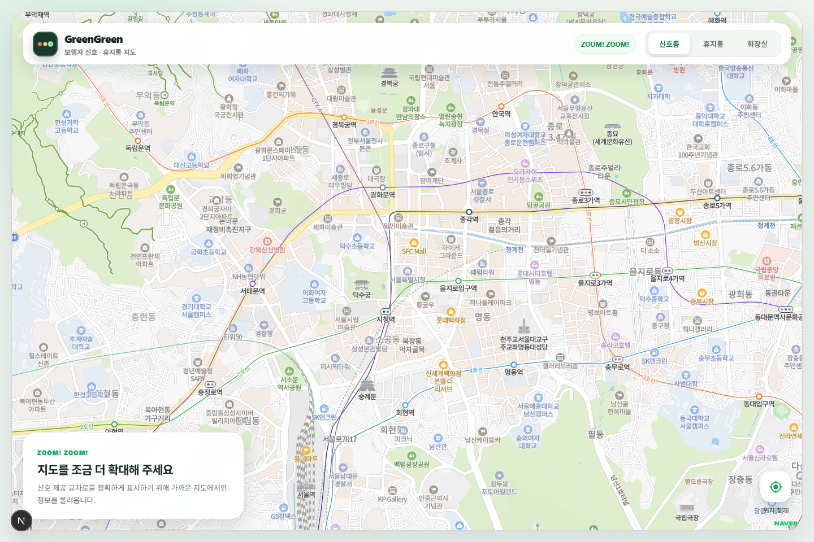
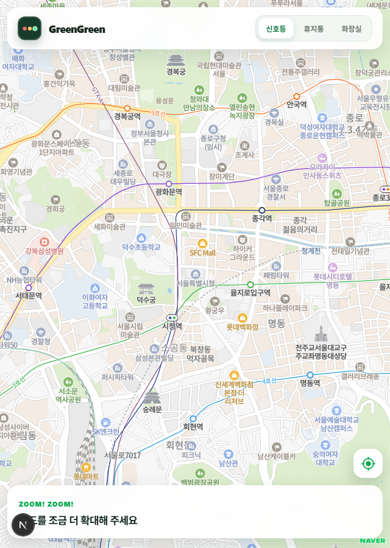
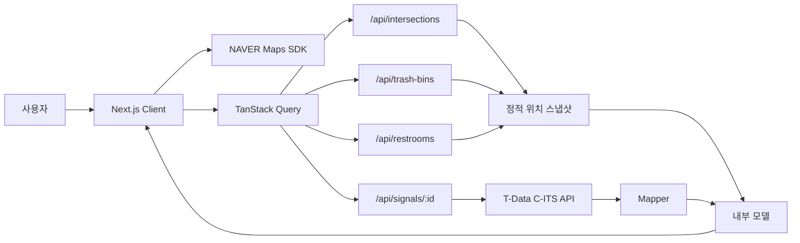

# GreenGreen: 실시간 보행신호와 생활 편의시설을 한 지도에 담기

길을 걷다가 이런 생각을 한 적이 있다.

> “다음 신호까지 얼마나 남았는지 지도에서 미리 볼 수 있다면 어떨까?”

처음에는 서울의 보행자 신호와 잔여시간을 보여주는 작은 지도로 시작했다. 그런데 실제로 사용해 보니 길 위에서 필요한 정보는 신호등 하나로 끝나지 않았다. 주변 휴지통이나 공중화장실도 같은 지도에서 바로 찾을 수 있으면 좋겠다는 생각이 들었다.

그렇게 **GreenGreen**은 실시간 보행신호와 생활 편의시설을 한 화면에서 탐색하는 지도 서비스가 됐다.

이 글에서는 서비스의 주요 기능뿐 아니라, 빠르게 변하는 신호 데이터와 수천 개의 위치 데이터를 어떤 구조로 다뤘는지 이야기해 보려고 한다. 코드 예시는 저장소에 공개해도 문제가 없는 부분만 골랐고, 실제 인증키나 환경변수 값은 포함하지 않았다.

## 먼저 둘러보기

- GitHub 저장소: [rladudtjr871/GreenGreen](https://github.com/rladudtjr871/GreenGreen)
- 로컬 실행 주소: [http://localhost:3000](http://localhost:3000)
- 배포 서비스: **배포 도메인 입력 필요**
- NAVER Maps JavaScript API: [공식 문서](https://navermaps.github.io/maps.js.ncp/)
- 서울교통빅데이터플랫폼 T-Data: [공식 사이트](https://t-data.seoul.go.kr/)

> 배포 주소는 저장소나 현재 환경설정에서 확인되지 않아 추측해서 적지 않았다. 블로그를 발행하기 전에 실제 서비스 URL로 위 항목만 교체하면 된다.

## 어떤 서비스인가

GreenGreen의 첫 화면은 지도다. 별도의 목록을 먼저 읽거나 검색어를 입력하지 않아도, 지도를 움직이고 확대하는 행동 자체가 검색이 된다.

상단의 탭에서는 다음 세 가지 레이어 중 하나를 고를 수 있다.

- **신호등**: 서울의 교차로 위치와 방향별 보행신호, 잔여시간
- **휴지통**: 공공데이터에 등록된 휴지통 위치와 이름
- **화장실**: 공중화장실 위치, 주소, 운영시간, 시설 정보

한 화면에 모든 마커를 겹쳐 놓지 않고 하나의 레이어만 활성화하도록 했다. 정보가 많아질수록 오히려 지도를 읽기 어려워지고, 사용하지 않는 데이터까지 가져오게 되기 때문이다.

### 데스크톱 화면



데스크톱에서는 지도 위에 브랜드, 레이어 탭, 서비스 상태, 가이드, 현재 위치 버튼을 겹쳐 배치했다. 지도가 화면의 주인공이 되도록 나머지 UI는 반투명 카드 형태로 정리했다.

### 작은 화면에서의 구성



작은 화면에서는 설명 문구를 줄이고 지도 영역을 최대한 확보했다. 현재 위치 버튼은 가이드 위쪽으로 이동하며, 신호 타이머나 화장실 상세 팝업을 열면 지도 조작에 방해되지 않도록 가이드와 위치 버튼을 잠시 숨긴다.

## 주요 동작

### 1. 지도를 움직이는 것이 곧 검색이다

사용자가 지도를 움직이는 동안에는 API를 계속 호출하지 않는다. 이동이 끝난 `idle` 이벤트를 기다린 뒤 400ms 동안 추가 움직임이 없을 때 현재 화면의 경계를 읽는다.

또한 줌 16 미만에서는 마커 데이터를 조회하지 않는다. 멀리 떨어진 상태에서 수천 개의 위치를 받아 와도 화면에서는 구분하기 어렵고, 네트워크와 렌더링 비용만 늘어나기 때문이다.

```ts
const isIntersectionQueryEnabled =
  activeLayer === "signals" &&
  mapStatus === "ready" &&
  viewport !== null &&
  viewport.zoom >= INTERSECTION_QUERY_MIN_ZOOM &&
  normalizedBounds !== null;

const intersectionsQuery = useQuery({
  queryKey: ["intersections", normalizedBounds],
  queryFn: () => fetchIntersections(normalizedBounds),
  enabled: isIntersectionQueryEnabled,
  placeholderData: keepPreviousData,
});
```

지도 경계는 일정 단위로 정규화해 Query Key에 넣었다. 손가락이나 마우스로 지도를 아주 조금 움직였다는 이유만으로 매번 완전히 다른 요청으로 취급되는 일을 줄일 수 있었다.

전체 흐름을 짧게 표현하면 다음과 같다.

```text
지도 이동 종료
  → 400ms debounce
  → 줌과 화면 경계 확인
  → 경계 정규화
  → 현재 레이어 데이터 요청
  → 기존 마커와 비교해 필요한 부분만 갱신
```

### 2. 신호등을 누른 순간에만 실시간 데이터를 가져온다

지도에 보이는 모든 교차로의 신호를 한꺼번에 요청하지 않는다. 교차로 위치는 정적 스냅샷에서 가져오고, 사용자가 마커를 선택했을 때만 그 교차로의 최신 신호를 조회한다.

```ts
const signalQuery = useQuery({
  queryKey: ["signal", selectedIntersection?.intersectionId],
  queryFn: () =>
    selectedIntersection
      ? fetchPedestrianSignal(selectedIntersection.intersectionId)
      : Promise.reject(new Error("교차로가 선택되지 않았습니다.")),
  enabled: selectedIntersection !== null,
  staleTime: 3_000,
});
```

마커를 선택하면 방향별 신호 상태와 남은 시간을 카드로 보여준다. 보행 가능 신호는 녹색, 정지 신호는 빨간색으로 표시하고, 선택한 교차로 마커 주변에도 횡단보도 방향별 상태 막대를 함께 그린다.

### 3. 1초마다 API를 호출하지 않는 카운트다운

실시간 잔여시간이라고 해서 서버에 매초 요청할 필요는 없다. 서버가 `18초`를 응답했다면 브라우저에서 수신 시각을 기억하고, 지나간 시간을 빼서 `18, 17, 16…`으로 표시할 수 있다.

```ts
const receivedTime = new Date(signal.receivedAt).getTime();
const elapsedSeconds = Math.max(
  0,
  Math.floor((now - receivedTime) / 1_000),
);

const remainingSeconds =
  direction.remainingSeconds === null
    ? null
    : Math.max(0, direction.remainingSeconds - elapsedSeconds);
```

매초 바뀌는 것은 React 화면의 현재 시각뿐이다. 네트워크 재조회는 잔여시간이 0초에 도달했거나 데이터가 오래되기 직전처럼 동기화가 필요한 시점에만 수행한다.

현장에서 확인했을 때 API 값과 실제 신호 사이에 약간의 지연도 있었다. 그래서 서버에서 받은 잔여시간에는 3초의 보수적인 안전 보정값을 적용했다. 0초가 되면 바로 호출하지 않고 1초 뒤 다시 조회하고, 갱신된 값도 1초 미만이면 2초 뒤 한 번 더 확인한다. 사용자가 누르는 새로고침 버튼에는 5초 쿨다운을 두었다.

### 4. 세 단계로 동작하는 현재 위치 버튼

현재 위치 버튼은 누를 때마다 역할이 바뀐다.

| 상태 | 동작 |
| --- | --- |
| 비활성 | 버튼을 누르면 현재 위치로 한 번 이동 |
| 현재 위치 | 다시 누르면 위치 고정 모드 시작 |
| 위치 고정 | GPS 위치가 바뀔 때마다 지도 중심을 따라 이동 |

위치 고정 상태에서는 기기의 방향 센서를 사용해 현재 위치 핀 뒤에 반투명한 부채꼴을 표시한다. 센서 값을 받을 수 없을 때는 위치의 이동 방향값을 보조 수단으로 사용한다. 사용자가 지도를 직접 드래그하거나 확대하면 자동 추적을 해제해, 지도와 버튼 상태가 서로 다르게 보이지 않도록 했다.

다만 웹의 방향 센서는 브라우저와 기기마다 지원 범위가 다르다. 특히 iOS에서는 사용자의 센서 권한 허용이 필요하고, 데스크톱이나 일부 기기에서는 방향값 자체가 제공되지 않을 수 있다. 이 경우에도 현재 위치 원형 핀과 위치 추적 기능은 그대로 동작한다.

### 5. 휴지통과 화장실은 필요한 범위만 보여준다

휴지통과 화장실은 실시간 API 대신 저장소에 포함된 정적 JSON 스냅샷을 사용한다. 그렇다고 수천 건을 브라우저로 한 번에 보내지는 않는다. Route Handler가 현재 지도 경계 안에 들어오는 데이터만 골라 반환한다.

```ts
export async function getRestroomsInBounds(bounds: MapBounds) {
  return restrooms.filter(({ coordinate }) => {
    const { latitude, longitude } = coordinate;

    return (
      latitude <= bounds.north &&
      latitude >= bounds.south &&
      longitude <= bounds.east &&
      longitude >= bounds.west
    );
  });
}
```

지도 어댑터에서는 응답이 바뀔 때 모든 마커를 지우고 다시 만들지 않는다. 기존 ID와 새 ID를 비교해 화면 밖으로 나간 마커만 제거하고, 새로 들어온 마커만 추가한다. 지도 이동 중 마커가 통째로 깜빡이던 문제를 이 방식으로 줄였다.

화장실 마커를 선택하면 다음 정보 중 원본에 값이 있는 항목만 팝업에 표시한다.

- 도로명주소와 지번주소
- 개방시간과 휴무일
- 남녀 및 장애인 화장실 현황
- 편의시설과 안전시설
- 관리기관 연락처와 비고

## 연동 서비스와 데이터

### NAVER Maps JavaScript API v3

NAVER Maps는 지도 렌더링과 지도 이동·확대 이벤트, 사용자 정의 마커, 좌표 및 경계 계산에 사용했다.

지도 SDK에 대한 의존성은 `naverMap.adapter.ts` 한곳에 최대한 모았다. 상위 로직에서는 `naver.maps.LatLng` 대신 아래처럼 프로젝트에서 정의한 단순 타입을 사용한다.

```ts
export type MapCoordinate = {
  latitude: number;
  longitude: number;
};
```

이렇게 해 두면 언젠가 지도 공급자를 바꾸더라도 UI와 비즈니스 로직 전체가 특정 SDK 타입에 묶이지 않는다.

### 서울교통빅데이터플랫폼 T-Data

T-Data의 C-ITS 데이터를 이용해 선택한 교차로의 방향별 보행신호와 잔여시간을 가져온다. 외부 응답 필드명은 UI에서 직접 사용하지 않고 mapper를 거쳐 내부 모델로 변환한다.

```text
T-Data 응답
  → 응답 형식 검사
  → signal mapper
  → PedestrianSignal
  → SignalCard
```

외부 API가 필드명을 바꾸거나 특수한 값을 내려주더라도 mapper 경계에서 처리할 수 있고, 화면 컴포넌트는 안정적인 내부 타입만 보면 된다.

### 공공데이터 스냅샷

현재 저장소 기준 데이터 규모는 다음과 같다.

| 레이어 | 데이터 | 레코드 수 | 주요 범위 |
| --- | --- | ---: | --- |
| 신호등 | V2X 교차로 MAP 정보 | 2,779 | 서울 |
| 휴지통 | 전국휴지통표준데이터 및 추가 지역 자료 | 3,753 | 원본에 좌표가 있는 지역 |
| 화장실 | 서울시·원주시 화장실 위치정보 | 4,475 | 서울·원주 |

주소만 있는 데이터는 사전에 지오코딩해 좌표를 저장하고, 서비스 실행 중에는 다시 지오코딩하지 않는 방향을 택했다. 런타임 호출량을 줄일 수 있고, 같은 주소가 매번 다른 결과로 해석될 가능성도 줄어든다.

추가 지역 데이터를 반복해서 반영할 수 있도록 병합 스크립트도 만들었다.

```bash
pnpm data:trash-bins:merge "C:\path\trash-bins.csv"
pnpm data:restrooms:merge "C:\path\restrooms.json"
```

이름과 좌표를 자연키로 사용해 기존 데이터는 갱신하고 새로운 데이터만 추가한다. 같은 파일을 다시 실행해도 중복 레코드가 계속 늘어나지 않도록 구성했다.

## API 키를 브라우저에 보내지 않는 구조

브라우저에서 T-Data를 직접 호출하면 인증키가 개발자 도구와 네트워크 요청에 노출될 수 있다. 그래서 모든 실시간 신호 요청은 Next.js Route Handler를 통과한다.

```text
Browser
  → GET /api/signals/:intersectionId
  → Next.js Route Handler
  → T-Data API
```

서버 전용 키는 `TDATA_API_KEY` 환경변수에서만 읽는다.

```ts
function getTDataApiKey(): string {
  const apiKey = process.env.TDATA_API_KEY?.trim();

  if (!apiKey) {
    throw new TDataApiError("TDATA_API_KEY가 설정되지 않았습니다.", 500);
  }

  return apiKey;
}
```

Route Handler에서는 교차로 ID를 숫자로 검증하고, 실시간 신호 응답에 `Cache-Control: no-store`를 적용한다. 캐시된 이전 신호가 현재 신호처럼 보이는 일을 막기 위해서다.

```ts
if (!/^\d{1,10}$/.test(intersectionId)) {
  return NextResponse.json(
    { message: "유효한 교차로 ID를 입력해 주세요." },
    { status: 400 },
  );
}

return NextResponse.json(signal, {
  headers: { "Cache-Control": "no-store" },
});
```

브라우저에서 반드시 필요한 NAVER Maps Web Client ID만 `NEXT_PUBLIC_` 환경변수로 사용한다. `.env.local`은 Git에서 제외하고, 블로그와 스크린샷에도 실제 값을 노출하지 않았다.

## 전체 구조



컴포넌트는 렌더링에 집중하고, 지도 이벤트와 Query, 위치 추적, 타이머 같은 로직은 각 컴포넌트의 훅으로 분리했다.

```text
TrafficMap/
├─ TrafficMap.tsx          # 화면 렌더링
├─ TrafficMap.module.css   # 반응형 스타일
└─ useTrafficMap.ts        # 지도·위치·조회 상태와 이벤트
```

지도 SDK 코드는 어댑터, 외부 데이터 변환은 mapper, 데이터 조회는 service, HTTP 경계는 Route Handler로 나눴다. 파일 수는 조금 늘어나지만 문제가 생겼을 때 어느 계층을 확인해야 하는지가 훨씬 분명해졌다.

## 실시간 정보라서 더 중요했던 안전 처리

보행신호는 단순한 편의 정보와 다르다. 오래된 녹색 신호를 현재 신호처럼 보여주는 것은 정보를 아예 보여주지 않는 것보다 위험할 수 있다.

그래서 다음 기준을 두었다.

- 관측 또는 수신 시각을 기준으로 일정 시간 이상 지난 데이터는 `stale` 처리한다.
- stale 상태에서는 원래 값이 녹색이어도 `정보 없음`으로 표시한다.
- V2X 규격의 invalid 잔여값은 실제 초로 표시하지 않는다.
- 외부 API 지연을 고려해 잔여시간에서 안전 보정값을 차감한다.
- 신호 카드에는 실제 신호등을 반드시 확인하라는 문구를 항상 표시한다.

GreenGreen은 횡단 여부를 결정해 주는 서비스가 아니라, 주변 정보를 조금 더 편하게 확인하도록 돕는 보조 도구다. 최종 판단은 항상 현장의 실제 신호등을 기준으로 해야 한다.

## 만들면서 부딪힌 문제들

### “실시간이면 1초마다 호출해야 하지 않을까?”

처음에는 가장 직관적인 방법처럼 보였다. 하지만 사용자가 늘면 호출량이 빠르게 증가하고, 외부 API가 잠시 느려지는 순간 화면도 함께 불안정해진다.

응답을 받은 시각을 기준으로 클라이언트에서 카운트다운하고, 필요한 순간에만 동기화하는 방식이 호출량과 화면 반응성을 모두 잡는 데 더 적합했다.

### 주소만으로 찍은 위치가 생각보다 정확하지 않았다

건물 주소는 한 필지나 건물 중심으로 변환되는 경우가 많다. 데이터 이름에 “매장 앞”, “출입구 옆” 같은 설명이 있어도 일반적인 지오코딩만으로 그 지점을 정확히 찾기는 어렵다.

현재는 제공된 좌표를 우선 사용하고, 주소만 있는 경우에는 사전 변환 결과를 스냅샷으로 저장한다. 위치가 실제와 다를 수 있다는 안내도 함께 제공한다. 장기적으로는 현장 검증 또는 더 정밀한 원천 데이터가 필요하다.

### 지도 이동 때 마커가 깜빡였다

범위가 바뀔 때마다 모든 마커를 제거하고 다시 만들면 구현은 단순하지만, 사용자는 마커가 한꺼번에 사라졌다 나타나는 모습을 보게 된다.

ID 기준으로 이전 결과와 새 결과의 차이를 계산해 제거·추가 대상을 최소화하니 이동 경험이 훨씬 자연스러워졌다.

### 웹에서 기기가 바라보는 방향을 받는 일

GPS의 `heading`은 실제 이동 중에만 의미 있는 값을 주는 경우가 많다. 제자리에서 휴대폰만 돌릴 때도 방향을 보여주려면 Device Orientation API가 필요했다.

기기 센서를 우선 사용하고 이동 방향을 대체값으로 두되, 권한이나 브라우저 지원 여부에 따라 방향 표시만 자연스럽게 생략하도록 만들었다. 핵심 기능인 현재 위치 표시는 센서 지원 여부와 분리했다.

## Codex를 어떻게 활용했나

이 프로젝트에서는 Codex를 한 번에 전체 기능을 만들어 주는 도구보다는, 구현과 검증을 함께 반복하는 페어 프로그래밍 파트너에 가깝게 사용했다.

- 큰 요구사항을 지도, 위치, 범위 조회, 마커, 신호, 카운트다운처럼 작은 단계로 나눴다.
- 기존 코드와 프로젝트 규칙을 먼저 읽게 하고 컴포넌트, 훅, 서비스, mapper의 책임을 함께 정리했다.
- hydration 오류, 마커 깜빡임, 타이머 재조회 시점처럼 재현 조건이 있는 문제의 원인을 추적했다.
- CSV와 JSON 원본을 내부 타입으로 바꾸는 스크립트를 만들고 중복 실행 결과를 검증했다.
- 변경 뒤에는 lint, TypeScript 검사, production build를 실행해 코드 생성에서 끝나지 않도록 했다.
- 커밋 전 diff를 다시 확인하고 `.env.local` 같은 민감 파일이 포함되지 않도록 점검했다.

물론 제안된 코드를 그대로 사용하는 것은 아니었다. 실제 현장에서 확인한 API 지연, 데이터의 정확도, 신호 표시의 안전 기준처럼 서비스 판단이 필요한 부분은 직접 기준을 정하고 결과를 다시 확인했다. 특히 실시간 안전 정보는 “코드가 동작한다”보다 “잘못된 상황에서 어떻게 보이는가”가 더 중요했다.

## 기술 스택

| 영역 | 사용 기술 |
| --- | --- |
| Framework | Next.js 16 App Router |
| Language | TypeScript 5 |
| UI | React 19, CSS Modules |
| Server State | TanStack Query 5 |
| Map | NAVER Maps JavaScript API v3 |
| Traffic Data | 서울 T-Data C-ITS API |
| Place Data | 교차로·휴지통·공중화장실 정적 스냅샷 |
| Package Manager | pnpm 12 |

## 아쉬운 점과 다음 단계

현재 서비스는 기능적으로 동작하지만 더 다듬고 싶은 부분도 많다.

1. **데이터 제공 지역 확대**  
   실시간 보행신호는 현재 서울을 중심으로 제공한다. 다른 지역의 동일한 품질과 형식의 데이터를 확보할 수 있다면 mapper와 source 계층을 확장할 수 있다.

2. **위치 데이터 검증 체계**  
   주소 기반 좌표는 현장 위치와 차이가 생길 수 있다. 사용자 제보나 관리자가 좌표를 검수할 수 있는 흐름을 추가하면 데이터 신뢰도를 높일 수 있다.

3. **공간 인덱스 적용**  
   지금 규모에서는 배열 필터링으로 충분하지만 데이터가 크게 늘어나면 R-tree, geohash 또는 공간 데이터베이스를 검토할 만하다.

4. **PWA와 모바일 앱 패키징**  
   위치와 방향 기능은 이동 중 사용할 때 가치가 크다. PWA 설치 경험을 먼저 다듬고, 필요하다면 Capacitor 같은 방식으로 iOS·Android 패키징을 검토할 수 있다.

5. **접근성과 현장 사용성 개선**  
   색상 외에도 상태를 구분할 수 있는 표현, 야외 시인성, 스크린 리더 안내, 한 손 조작 범위를 계속 점검할 계획이다.

## 마치며

GreenGreen을 만들면서 가장 많이 고민한 것은 “데이터를 얼마나 많이 보여줄까”보다 “언제, 어떤 데이터를 믿고 보여줄까”였다.

지도 범위 안의 데이터만 가져오고, 선택한 교차로만 실시간으로 조회하고, 서버 응답 사이의 시간은 클라이언트에서 계산했다. 오래된 신호는 과감히 숨기고, 외부 데이터는 mapper와 내부 타입 사이에 경계를 두었다. 휴지통과 화장실처럼 양이 많은 데이터는 미리 정리한 스냅샷으로 관리했다.

작은 지도 서비스처럼 보이지만 지도 SDK, 실시간 API, 공공데이터 정제, 위치 센서, 반응형 UI, 안전한 표시 기준까지 다양한 문제를 한 번에 경험할 수 있었던 프로젝트였다.

앞으로도 GreenGreen은 “길 위에서 지금 필요한 정보를 빠르고 안전하게 보여주는 지도”라는 방향을 유지하며 조금씩 확장해 나갈 예정이다.

> 제공되는 신호정보는 통신 상태에 따라 실제 신호와 차이가 발생할 수 있습니다. 횡단 시에는 반드시 현장의 실제 신호등을 확인해야 합니다.
